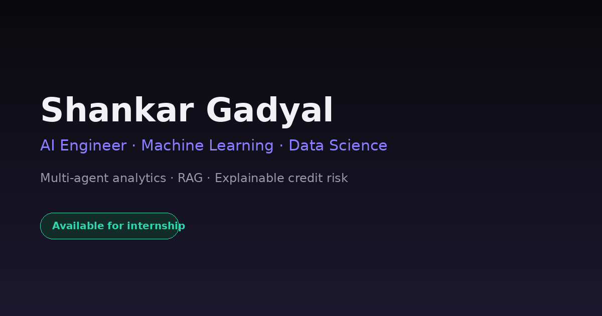

# 🚀 DataMind Nexus — AI Engineer Portfolio

<p align="center">
  
</p>

<p align="center">
  <strong>A modern AI Engineer portfolio showcasing production-ready Machine Learning, LLM, RAG, Multi-Agent AI, and Cloud-Deployed applications.</strong>
</p>

<p align="center">
  
  
  
  
  
  
</p>

---

## 🌐 Live Demo

**Portfolio:** https://your-portfolio-url.com

---

# 📖 About

**DataMind Nexus** is my personal AI Engineer portfolio designed to showcase real-world Machine Learning, Artificial Intelligence, and Data Science projects.

The portfolio demonstrates production-ready AI applications, interactive project showcases, certifications, technical skills, and an intelligent AI assistant (**NOVA**) that answers questions about my projects and experience.

The frontend is built entirely with **HTML, CSS, and Vanilla JavaScript**, while the backend uses **Flask** and **Groq LLM** to power the conversational AI assistant.

---

# ✨ Features

- 🤖 AI Assistant (NOVA)
- 📂 Interactive Project Showcase
- 📱 Fully Responsive Design
- 🌙 Premium Dark UI
- 📜 Resume Download
- 🎓 Certifications Gallery
- 📊 Skills & Technologies
- 📞 Contact Section
- ⚡ Fast Loading Performance
- ☁️ Google Cloud Run Deployment

---

# 🛠 Tech Stack

### Frontend

- HTML5
- CSS3
- Vanilla JavaScript (ES6)

### Backend

- Python
- Flask

### AI

- Groq LLM
- Prompt Engineering

### Deployment

- Google Cloud Run
- Docker

### Version Control

- Git
- GitHub

---

# 📂 Portfolio Projects

## 🧠 DataMind AI

An autonomous multi-agent analytics platform capable of generating business insights, visualizations, and ML predictions from uploaded datasets.

### Features

- Multi-Agent AI
- Automated Data Analysis
- Interactive Dashboard
- Data Visualization
- Machine Learning Pipeline

---

## 📈 FinSight AI

An AI-powered financial analytics platform that combines Machine Learning, Sentiment Analysis, Explainable AI, and Time Series Forecasting.

### Features

- Stock Prediction
- News Sentiment Analysis
- SHAP Explainability
- Technical Indicators
- AI Financial Assistant

---

## 👥 CustomerIQ

Customer analytics platform for churn prediction, customer segmentation, and revenue forecasting.

### Features

- Churn Prediction
- Customer Segmentation
- Revenue Forecasting
- Explainable Machine Learning

---

## 💳 CreditIQ

Machine Learning application for intelligent credit risk assessment and loan eligibility prediction.

### Features

- Loan Risk Prediction
- Credit Scoring
- Risk Analysis
- Explainable AI

---

# 📸 Screenshots

## Home


---

## Projects


---

## AI Assistant


---

# 🎓 Certifications

- Machine Learning Using Python — Infosys Springboard
- Natural Language Processing — Infosys Springboard

---

# 🏗 Project Structure

```
.
├── index.html
├── app.py
├── requirements.txt
├── Dockerfile
├── .env.example
├── resume.pdf
└── images/
    ├── profile.jpg
    ├── favicon.svg
    ├── og-cover.png
    ├── datamind-1..3.png
    ├── finsight-1..3.png
    ├── customeriq-1..3.png
    ├── creditiq-1..3.png
    ├── cert-infosys-ml.png
    ├── cert-infosys-nlp.png
    └── cert-placeholder.png
```

---

# 🚀 Run Locally

Clone the repository

```bash
git clone https://github.com/shankargadyal/datamind-nexus.git
```

Go to the project directory

```bash
cd datamind-nexus
```

Install dependencies

```bash
pip install -r requirements.txt
```

Create a `.env` file

```env
GROQ_API_KEY=your_api_key
```

Start the Flask server

```bash
python app.py
```

Open

```
http://localhost:8080
```

---

# 🤖 NOVA Architecture

```
Browser
     │
     ▼
Flask Backend
     │
     ▼
Groq LLM API
```

The browser never has access to the API key.

The backend:

- Stores the system prompt
- Handles conversation history
- Applies rate limiting
- Validates requests
- Returns safe fallback responses

---

# 🔌 API Endpoints

| Method | Endpoint | Description |
|----------|-------------|------------------------------|
| POST | `/api/chat` | Chat with NOVA |
| GET | `/api/health` | Health Check |

---

# ☁️ Deploy to Google Cloud Run

```bash
gcloud run deploy datamind-nexus \
  --source . \
  --region asia-south1 \
  --allow-unauthenticated \
  --set-env-vars GROQ_API_KEY=your_api_key
```

---

# 📌 Future Improvements

- Voice-enabled AI Assistant
- Dark/Light Theme Toggle
- Blog Section
- AI Resume Analyzer
- Interactive Coding Playground
- More AI Projects
- Visitor Analytics Dashboard

---

# 👨‍💻 About Me

Hi, I'm **Shankar Gadyal**, an aspiring AI Engineer and MSc Data Science student passionate about Machine Learning, Artificial Intelligence, Generative AI, and Full-Stack AI Applications.

I'm actively building production-ready AI systems and continuously exploring modern LLMs, Multi-Agent AI, RAG, and Explainable AI.

---

# 📬 Connect With Me

- 💼 LinkedIn: https://www.linkedin.com/in/shankargadyal
- 💻 GitHub: https://github.com/shankargadyal
- 📧 Email: gadyalshankar@gmail@.com
- 🌐 Portfolio: https://your-portfolio-url.com

---

# ⭐ Support

If you found this project helpful, please consider giving it a ⭐ on GitHub.

It motivates me to keep building and sharing more AI projects.

---

# 📄 License

This project is licensed under the MIT License.

---

<p align="center">
Made with ❤️ by <strong>Shankar Gadyal</strong>
</p>
